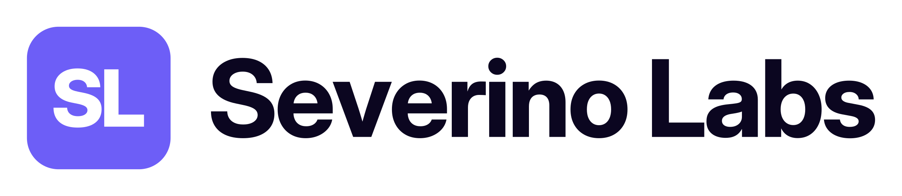
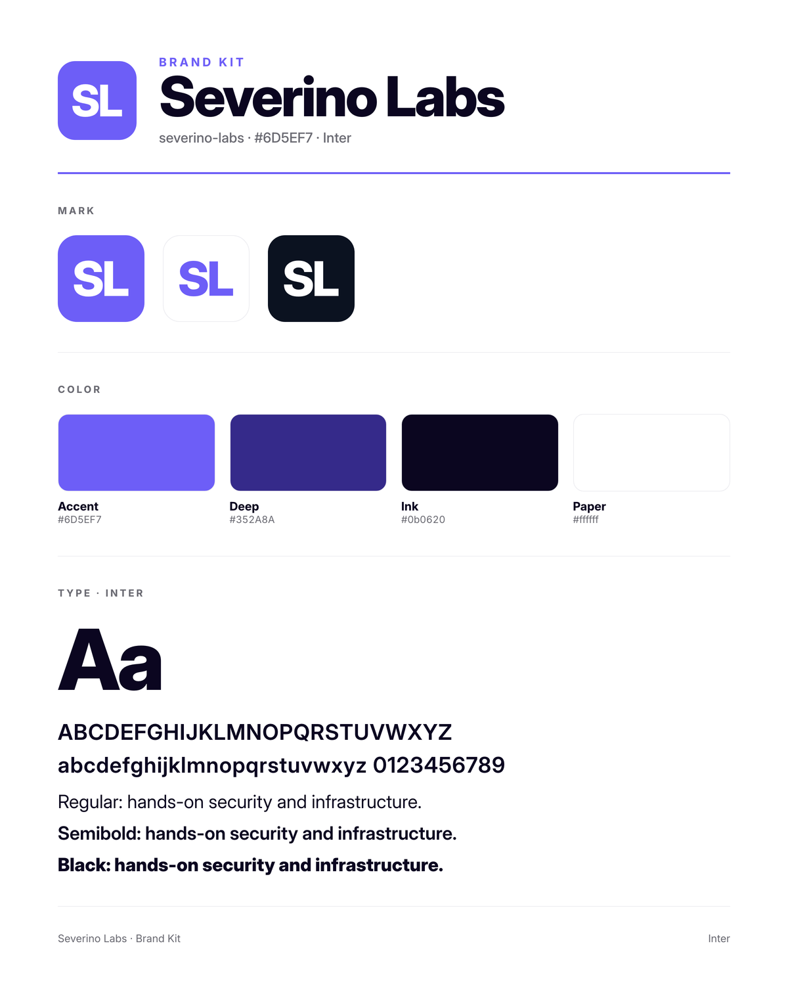
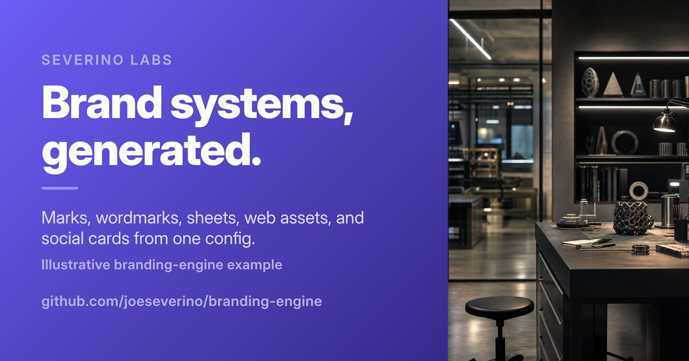
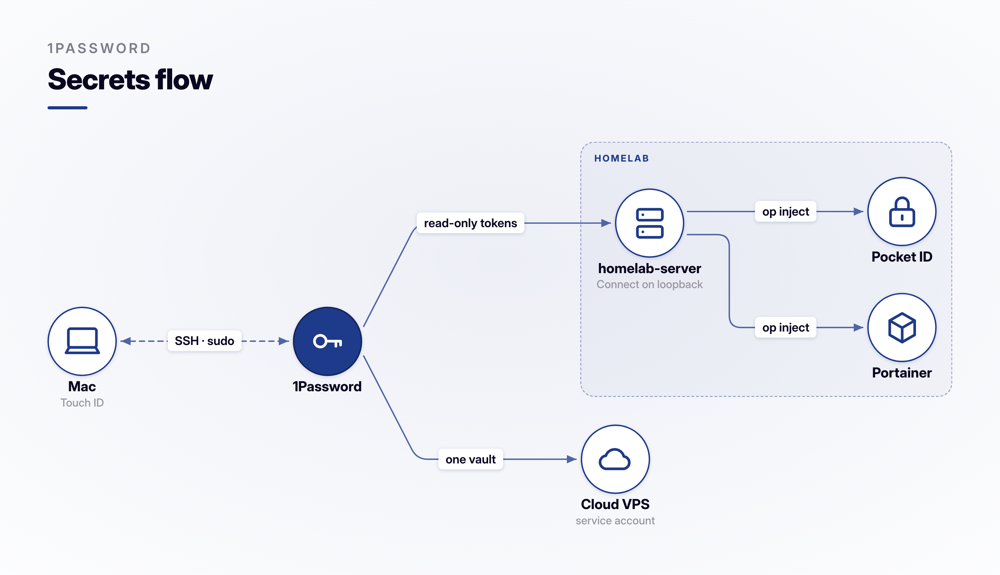

# branding-engine

[](https://www.npmjs.com/package/branding-engine)
[](https://github.com/joeseverino/branding-engine/actions/workflows/ci.yml)
[](https://nodejs.org)
[](./LICENSE)

Generate a consistent brand kit from a compact alphanumeric mark and one accent
color. Outputs include favicons, vector and raster marks, wordmark lockups,
brand sheets, social cards, manifests, and CSS tokens.

The mark and wordmark use real font outlines. The common website path requires
only Node.js; browser rendering is optional.

## Example

Illustrative input using a non-production sample palette:

```json
{
  "name": "Severino Labs",
  "identity": {
    "slug": "severino-labs",
    "color": "#6D5EF7",
    "deep": "#352A8A",
    "onColor": "#FFFFFF",
    "glyph": "SL",
    "wordmark": "Severino Labs"
  },
  "portrait": "./studio.jpg",
  "cardPalette": {
    "accent": "#9B8CFF",
    "textSoft": "#E3DEFF",
    "textMuted": "#B7AFE8"
  },
  "cards": [
    {
      "file": "social-card.png",
      "width": 1200,
      "height": 630,
      "photoWidth": 420,
      "eyebrow": "Severino Labs",
      "name": "Brand systems, generated.",
      "tagline": "Marks, wordmarks, sheets, web assets, and social cards from one config.",
      "meta": "Illustrative branding-engine example",
      "url": "github.com/joeseverino/branding-engine"
    }
  ]
}
```

Generated mark:


Generated wordmark:



Generated brand sheet:



Generated social card:



The complete input and committed generated output are in
[`examples/severino-labs`](./examples/severino-labs/).

## Requirements

- Node.js 24 or newer
- `sharp`, OpenType.js, and the WOFF2 decoder, installed automatically
- Optional: `@playwright/test` plus Chromium for brand sheets and social cards

Install:

```bash
npm install branding-engine
```

For a project-local CLI installation:

```bash
npm install --save-dev branding-engine
npx branding-engine --help
```

The package can also be installed globally with
`npm install --global branding-engine`, though project-local installation keeps
the version reproducible for collaborators and CI.

For sheets and social cards:

```bash
npm install --save-dev @playwright/test
npx playwright install chromium
```

## Glyph Rules

`glyph` is the compact mark rendered inside the tile.

- Accepts 1-3 ASCII letters or digits
- Lowercase letters are normalized to uppercase
- Spaces, punctuation, symbols, and strings longer than three characters fail
- Layout dynamically adjusts by character count and caps narrow marks by height

Valid:

```text
A
AC
A3X
7
R2
```

Invalid:

```text
ABCD
A C
A-C
@
```

## Quick Start: Add Branding to a Website

Use `init` and `generate` when a site needs favicons, a manifest, and CSS
tokens in its public directory.

```bash
npm install --save-dev branding-engine
npx branding-engine init
```

Edit the generated `brand.config.json`:

```json
{
  "name": "My Site",
  "accent": "#2563EB",
  "deep": "#173B8F",
  "onColor": "#FFFFFF",
  "glyph": "MS"
}
```

Then generate the files:

```bash
npm run brand
```

Default output:

```text
public/
├── apple-touch-icon.png
├── brand-tokens.css
├── favicon-32.png
├── favicon-192.png
├── favicon.ico
├── favicon.svg
└── site.webmanifest
```

The command also prints the `<head>` links to add to the site.

### Website Config Reference

| Field | Required | Description |
|---|---:|---|
| `name` | yes | Application name used in `site.webmanifest` |
| `accent` | yes | Six-digit hex accent, with or without `#` |
| `glyph` | yes | One to three alphanumeric mark characters |
| `deep` | no | Dark palette shade; derived from `accent` when omitted |
| `onColor` | no | Glyph color on the accent; defaults to `#FFFFFF` |

Options:

```bash
branding-engine generate --config path/to/brand.config.json --public path/to/public
```

Generated files are deterministic and intended to be committed with the site.

### Astro

Astro serves files from `public/` at the site root, so the default generator
paths work without customization:

```bash
npm install --save-dev branding-engine
npx branding-engine init
npm run brand
```

In your shared layout, add the generated links and tokens:

```astro
<html lang="en">
  <head>
    <link rel="icon" href="/favicon.ico" sizes="any" />
    <link rel="icon" type="image/svg+xml" href="/favicon.svg" />
    <link rel="apple-touch-icon" href="/apple-touch-icon.png" />
    <link rel="manifest" href="/site.webmanifest" />
    <link rel="stylesheet" href="/brand-tokens.css" />
    <meta name="theme-color" content="#2563EB" />
  </head>
  <body><slot /></body>
</html>
```

To regenerate before every production build, add it to the existing build
script:

```json
{
  "scripts": {
    "brand": "branding-engine generate",
    "build": "npm run brand && astro build"
  }
}
```

### Plain HTML or Static Site

If the repository already publishes a `public/` directory, use the same
default commands as Astro. If the repository root itself is deployed:

```bash
npx branding-engine generate --public .
```

Add the links printed by the command to the page `<head>`, plus the token
stylesheet:

```html
<link rel="stylesheet" href="/brand-tokens.css" />
```

The generated CSS variables can then be used from any stylesheet:

```css
.button {
  color: var(--brand-on-accent);
  background: var(--brand-accent);
}
```

## Full Brand Kit

Use `build` for a reusable config-driven kit:

```bash
branding-engine build --config ./brand --out ./kits
```

`--config` accepts either a `brand.json` path or a directory containing
`brand.json`. An optional `surfaces.json` can live beside it.

Minimal `brand.json`:

```json
{
  "name": "Acme",
  "identity": {
    "slug": "acme",
    "color": "#1E3A8A",
    "glyph": "AC",
    "wordmark": "Acme Corp"
  }
}
```

Expanded `brand.json`:

```json
{
  "name": "Acme",
  "font": "./AcmeSans.ttf",
  "weight": 800,
  "wordmarkWeight": 700,
  "identity": {
    "slug": "acme",
    "color": "#1E3A8A",
    "deep": "#14245C",
    "onColor": "#FFFFFF",
    "glyph": "A3C",
    "wordmark": "Acme Corp"
  },
  "portrait": "./portrait.jpg",
  "cardPalette": {
    "accent": "#5B82D6",
    "textSoft": "#DDE6FB",
    "textMuted": "#A9C0E8"
  },
  "cards": [
    {
      "file": "social-card.png",
      "width": 1200,
      "height": 630,
      "photoWidth": 420,
      "eyebrow": "Acme Corp",
      "name": "Acme",
      "tagline": "Built for what comes next.",
      "meta": "Brand systems and engineering",
      "url": "acme.example"
    }
  ]
}
```

### Full Config Reference

| Field | Required | Description |
|---|---:|---|
| `name` | no | Human-readable brand name used in logs and fallbacks |
| `identity` | yes | Primary brand identity object |
| `identity.slug` | yes | Output directory name |
| `identity.color` | yes | Six-digit accent color |
| `identity.glyph` | yes | One to three alphanumeric mark characters |
| `identity.wordmark` | no | Text used for wordmark lockups and sheet title |
| `identity.deep` | no | Curated dark shade |
| `identity.onColor` | no | Glyph color on accent |
| `font` | no | Font path relative to `brand.json`; defaults to bundled Inter |
| `weight` | no | Mark font weight; defaults to `800` |
| `wordmarkWeight` | no | Wordmark font weight; defaults to `700` |
| `surfaces` | no | Inline additional surfaces; `surfaces.json` takes precedence |
| `portrait` | for cards | JPEG path relative to `brand.json` |
| `cardPalette` | for cards | Card accent and supporting text colors |
| `cards` | no | Social-card definitions rendered to `<out>/cards/`; `file`, `width`, `height` and `photoWidth` are required, the text fields (`eyebrow`, `name`, `tagline`, `meta`, `url`) default to empty |

Additional surfaces inherit the primary glyph unless they override it:

```json
{
  "support": {
    "color": "#1F4D57",
    "wordmark": "Acme Support"
  },
  "labs": {
    "color": "#7C3AED",
    "glyph": "A3",
    "wordmark": "Acme Labs"
  }
}
```

## One-Off Kit

Create a kit without a config file:

```bash
branding-engine kit acme ff5733 AC "Acme Corp"
```

Three-character example:

```bash
branding-engine kit prism 635bff P3X "Prism Works" \
  --only mark,wordmark,web \
  --out ./kits
```

Syntax:

```text
branding-engine kit <slug> <hex> <glyph> ["Wordmark"] [options]
```

## Pictogram Tiles

A rounded tile with a centered stroke glyph — the pictogram counterpart of the
letterform mark, for app icons, vault icons, and avatars where a picture reads
better than a monogram. Uses the same glyph set as topology figure nodes, plus
`home`. No browser needed.

```bash
branding-engine pictogram server 1e3a8a --name rack --out ./icons
branding-engine pictogram --logo ./logo.svg ffffff --circle-preview --out ./icons
branding-engine pictogram --spec pictograms.json --out ./icons
```

Instead of a named glyph: `--text ABC` sets 1-3 letters as a letterform tile,
and `--logo <file>` composites an arbitrary SVG/PNG — as-is in its own colors,
or recolored with `--tint <color>` (monochrome SVG artwork only). `--fit` caps
the logo's share of the tile (default 0.62).

Colors are hex values or token names (`accent`, `deep`, `onAccent`, `ink`,
`paper`) resolved from `--tokens <tokens.css>` over the engine defaults.

`--variants light,dark` renders the standard pair from one input — colored
artwork on a paper tile (light) and white artwork on the colored tile (dark) —
as `<name>-light-*` / `<name>-dark-*`. Logo variants require `--tint`.

`--circle-preview` also writes `<name>-circle.png` with a circular mask
applied — many icon consumers (avatar chips, vault pickers) crop tiles to a
circle, and the preview verifies the fit before uploading. It defaults ON for
logo tiles (`--no-circle-preview` disables).

A spec is an array of `{ glyph | text | logo, hex, name?, size?, fit?, tint?,
variants?, circlePreview? }`; `name` defaults to the glyph, text, or logo
basename and only affects filenames (`<name>.svg` for vector tiles,
`<name>-<size>.png`, default size 512).

## Figures

Designed, brand-themed graphics for writeups, README banners, and OG/social cards, from a
small spec instead of code. Same headless-Chromium + bundled Inter pipeline as the social
cards.

```bash
branding-engine figure secrets.fig \
  --tokens ./kits/severino-labs/web/tokens.css \
  --out secrets.png          # defaults to <spec>.png
```

### Diagrams: the `.fig` format

Write the nodes and the arrows; the engine lays them out (ELK's layered algorithm), measures
every label, keeps labels off lines, draws groups, and fits the result to the frame.

```text
title: Secrets flow
subtitle: secret store

Laptop [icon: laptop, note: Touch ID]
Secret store [icon: key, anchor]
Private network [dashed] {
  app-server [icon: server, note: renders hourly]
  Identity provider [icon: lock]
  Container UI [icon: container]
}
Cloud VM [icon: cloud, note: service account]

Laptop <> Secret store: SSH · sudo [dashed]
Secret store > app-server: read-only token
Secret store > Cloud VM: one vault
app-server > Identity provider, Container UI: inject
```



- **Nodes**: `Name [props]`. The name is the id and the default label; a name first used in a
  connection becomes a plain node. Props are `key: value` pairs or flags: `anchor`, `attacker`,
  `muted` (role), `box` (shape). Quote a name that holds an arrow, a comma or `: `
  (`"Build > Test"`).
- **Arrows** (spaces around them): `>` `<` `<>` `-` are solid, `-->` `<--` `<-->` `--` are dashed.
  `->`, `<-`, `<->` also work. Chain them (`A > B > C`), fan out (`A > B, C`), label with
  `: text`, and add link props at the end: `A > B: text [dotted, accent, width: 4]`. A link
  from a node to itself, or an arrow with nothing on one side, is an error.
- **Groups**: `Label [dashed] { ... }`, nested as deep as needed. Declaring a node inside a
  group (its name on its own line, or with `[props]`) puts it there; a name first mentioned in a
  link inside a group joins it unless it is declared elsewhere. A node sits in one group.
- **Links to groups**: use a group's label as a link end (`Mac <> Servers: user cert`) and the
  line stops at the group's border, so one link and one label stand for every member. The group
  can be declared above or below the link. Two groups with the same label, a node and a group with
  the same name, or a link between a group and something inside it are errors.
- **Directives**: `title`, `subtitle`, `layout`, `direction` (`right` default, `down`, `left`,
  `up`), `routing` (`orthogonal` default, `straight`, `curved`), `theme`, `size` (`cover` or
  `1600x900`), `textScale`, `nodeScale`, `spread`. An unknown directive is an error with a
  suggestion (`layot: auto` → did you mean `layout`?), and so is Mermaid-style `A->B`.
- Quote values that hold commas; `\n` breaks a line. `#` and `//` start a comment at the start
  of a line or after a space, so `C#` and `https://` are safe. Every problem in a file is reported
  at once, with its line number.

Examples: [`examples/figures/`](./examples/figures) (a nested-group mesh network, a star lab, a
dark pipeline of box nodes).

### Warnings and `--strict`

After layout the engine checks its own work and prints a `warn` line for anything a reviewer
would catch by eye: labels that overlap each other, a node, or a link (a group's label first slides
along its top edge to clear any line); a group that covers a node
it does not contain; an empty group or a self-link in a JSON spec (neither is drawn); text scaled
below 70% to fit the frame. `--strict` turns any warning into a failure and writes nothing, for
CI or for an agent that cannot look at the PNG.

Before warning about small text, `auto` layout tries to fix it: it wraps a long run into rows
that still read left to right, tries top to bottom when no `direction` was set, and finally
shrinks circles and gaps (never the text). A graph that is wide by nature (eight or more nodes in
one chain of steps, plus groups) can still land under 70%: split it, or set a `size` and accept
the warning.

### JSON specs

A `.fig` compiles to the JSON `topology` (alias `diagram`) spec, which can also be written
directly. Every key is validated: an unknown key or value fails with its path and a suggestion
(`node "a".labelpos: unknown key (did you mean "labelPos"?)`).

| Top level | Default | Notes |
|---|---|---|
| `template` | (required) | `topology` / `diagram`, or a classic template below |
| `layout` | `auto` (`star` if any node has `pos`, `free` if any has `at`, `row` if the spec has no `links` key) | `auto`, `star`, `ring`, `row`, `grid`, `free` |
| `size` | content-sized, 1600 wide (`star`/`ring`: `topo`) | preset (`cover` 1600×900, `wide`, `topo` 1500×1000, `og`, `github`, `square`) or `[w, h]`; content is scaled to fit and centered |
| `theme` | `light` | `light` or `dark` |
| `title`, `subtitle` | none | header in the cover style |
| `direction`, `routing` | `right`, `orthogonal` | `auto` layout only. With no `direction`, a figure too wide to read may wrap or turn to `down` |
| `textScale`, `nodeScale`, `spread` | `1` | text size, circle size, spacing multipliers. In `topology` specs with a fixed layout (`star`, `ring`, `row`, `free`), a `nodeScale` under 0.5 is read the old way, as a fraction of the frame (0.16 was the default) |
| `fit` | `true` | `false` keeps layout scale (still centered) |
| `colors` | from `--tokens` | inline `{ accent, deep, onAccent, ink, paper }` |

| Node key | Notes |
|---|---|
| `id` | required, unique |
| `label`, `note` | `note` is a lighter second line (`addr` is accepted as an alias) |
| `icon` | `laptop monitor desktop server database switch router cloud phone home key shield grid user bot lock globe terminal firewall container file wifi cpu mail code` |
| `shape` | `circle` (glyph, label outside) or `box` (label inside, optional glyph) |
| `role` | `anchor` / `attacker` fill the node; `muted` dashes it in gray |
| `color` | hex or `accent`, `deep`, `ink`, `muted` |
| `group` | group id (or list the node in the group's `nodes`) |
| `pos` | `star`: `center`, `n s e w ne nw se sw`. Omit and spokes are assigned w, e, s, n, ... around the anchor |
| `at` | `free`: `[x, y]` fractions of the frame. `grid`: `[col, row]` |
| `scale` | per-node circle size |
| `labelPos`, `labelAt`, `labelW` | pin the label (`below above left right ne nw se sw`), offset it `[dx, dy]` from center, or set its wrap width. Default is automatic placement |

| Link key | Notes |
|---|---|
| `from`, `to` | node or group ids (checked, with suggestions); a group end stops at its border |
| `label` | a chip on the line |
| `fromLabel`, `toLabel` | small text past each arrowhead (an IP octet) |
| `dir` | `to`, `from`, `both` (default), `none` |
| `style` | `solid`, `dashed` (real dashes; the round-dot look of 0.7 and earlier is `dotted`), `dotted` |
| `color`, `width` | `accent` draws an overlay/attack path with a bordered chip |
| `curve` | bend as a fraction of length (fixed layouts); parallel links bend apart on their own |

| Group key | Notes |
|---|---|
| `id`, `label` | the label is the container's eyebrow |
| `nodes` | member node ids |
| `parent` | another group's id, for nesting |
| `style`, `color` | `dashed` border; border color |

Layouts: `auto` (ELK, the default), `star` (hub and spokes, straight by construction; the hub
label takes the widest gap), `ring`, `row` (a chain; omitting `links` chains the nodes in
order), `grid`, and `free` (explicit `at`). The fixed layouts place link chips and node labels
by scoring candidate spots against every line, node and label.

### Upgrading from 0.7

- `TEMPLATES.topology` and `TEMPLATES.diagram` are the marker string `'graph'`, not a render
  function: graph figures measure their text in the page, so render them with `renderFigure`.
- `figureSize(spec)` returns `null` for a graph with no `size` and a non-radial layout, since its
  canvas follows the drawing.
- Specs are validated: unknown keys and values that used to be ignored now throw
  `FigureSpecError`, and a link to a missing node is an error instead of being dropped.
- A spec with links but no `layout` and no positions now gets `auto` layout (it used to be a
  row). A spec with no `links` key still chains its nodes in a row.
- `style: dashed` draws real dashes; use `dotted` for the old look.

### Classic templates

Fixed-geometry cards, still supported:

**`title`**: eyebrow + headline + optional sub-line and footer. The all-purpose cover/banner.

```json
{ "template": "title", "size": "og", "theme": "dark",
  "eyebrow": "Diamond Model", "headline": "Marks & Spencer\nCyberattack",
  "subline": "Identity-based intrusion mapped to MITRE ATT&CK.", "footer": "jseverino.com" }
```

**`flow`**: stacked left-to-right step chains (before/after). `rows[].anchor` highlights one step.

```json
{ "template": "flow", "theme": "light", "rows": [
  { "label": "Before", "steps": ["Browser", "PHP", "MySQL"] },
  { "label": "After", "steps": ["Markdown", "Astro", "Cloudflare"], "anchor": "Cloudflare" } ] }
```

**`diamond`**: the four-vertex model around a center (`top`/`left`/`right`/`bottom` + `center`).

**`nodes`**: a generic graph of label boxes: `layout` of `row`, `ring`, or `grid`, a `nodes`
list, and an optional `center`.

Output renders at 2× the logical size (override with `--scale`).

## Stages

Select stages with a comma-separated `--only` value:

```bash
branding-engine build \
  --config ./brand.json \
  --out ./kits \
  --only mark,wordmark,web
```

| Stage | Browser needed | Output |
|---|---:|---|
| `mark` | no | Favicons, vector mark, PNG marks, transparent variants |
| `wordmark` | no | Vector and PNG title-case/all-caps lockups |
| `web` | no | CSS tokens, web manifest, and `<head>` snippet |
| `sheet` | yes | Brand overview poster, sections, and generated kit README |
| `cards` | yes | Configured social-card PNGs |

Without `--only`, all stages run.

## Output Layout

Each kit is written under `<out>/<slug>/`:

```text
<out>/<slug>/
├── icons/
├── mark/
├── sheet/
├── web/
└── wordmark/
```

Social cards are written to `<out>/cards/`.

## Programmatic API

```js
import {
  buildBrand,
  buildKit,
  generateSite,
  markSvg,
  normalizeGlyph,
  renderMarkSet,
  wordmarkSvg,
} from 'branding-engine';

await buildKit({
  slug: 'acme',
  hex: '#FF5733',
  glyph: 'a3x',
  wordmark: 'Acme',
  only: 'mark,wordmark,web',
  outDir: 'public/brand',
});

const glyph = normalizeGlyph('a3x'); // "A3X"
const mark = markSvg({ size: 64, bg: '#FF5733', glyph });
const markSet = await renderMarkSet({ hex: '#FF5733', glyph });
const lockup = wordmarkSvg({
  tileHex: '#FF5733',
  text: 'Acme',
  glyph,
});
```

Main exports:

- `buildBrand(options)`
- `buildKit(options)`
- `initSite(options)`
- `generateSite(options)`
- `makeMark(options)`
- `renderMarkSet(options)` — emit the canonical SVG, PNG, and ICO buffers once
  for consumers that own a custom filesystem layout
- `makeWordmark(options)`
- `makeSheet(options)`
- `makeWeb(options)`
- `makeCards(options)`
- `makePictogram(options)` / `makePictograms(options)`: a single tile resolves to `{ png, svg?, circle? }`,
  a `variants` pair to `{ light?, dark? }`; `isPictogramFiles(result)` tells them apart
- `resolveColor(value, tokens)` / `tintSvg(svgText, hex)`
- `markSvg(options)`
- `pictogramSvg(options)` / `PICTOGRAMS`
- `wordmarkSvg(options)`
- `normalizeGlyph(glyph)`
- `renderCard(browser, options)`
- `launchBrowser()`
- `makeFigure(options)` / `readSpec(path)`: render a `.fig` or JSON spec file; `strict: true`
  throws on warnings before anything is written
- `renderFigure(browser, spec, options)`: one spec on a caller-owned browser, returning the PNG
  buffer and its `warnings`
- `parseFig(text)`: `.fig` text to a JSON spec; throws `FigureSpecError` (with `.errors`)
- `figureSize(spec)`: the canvas for classic and radial specs; `null` for content-sized graphs
- `palette(theme, tokens)` / `SIZES` / `TEMPLATES`

### TypeScript

The package is ESM and ships compiled JavaScript with type declarations; no build step or
`.ts` source is needed to consume it. Option and result types (`BrandConfig`, `PictogramInput`,
`FigureSpec`, `Palette`, and the rest) are exported from the package root. `launchBrowser` and
`renderCard` work with a Playwright `Browser`; the declarations describe the few members they use,
so type-checking a project does not require `@playwright/test` to be installed.

## Fonts and Glyph Extraction

Bundled Inter caches include uppercase letters and digits for marks, plus
uppercase, lowercase, digits, and spaces for wordmarks.

Custom fonts and missing characters are extracted entirely in Node with
OpenType.js and a WebAssembly WOFF2 decoder. No Python, fonttools, native
binding, or system font utility is required. Supported input formats are TTF,
OTF, WOFF, and WOFF2.

Extracted caches are written under `.brand-cache/`, or the directory specified
by `BRAND_CACHE_DIR`. The installed package is never modified. If a variable
font cannot be instantiated at the requested `weight`, the build exits with the
font filename and parser error; use a static font file or another supported
variable font.

## Errors

The CLI exits nonzero with an actionable message for invalid glyphs, invalid
colors, missing or invalid configs, unknown `--only` stages, flags that need a
value, unavailable font glyphs, or missing optional browser dependencies. A
config with several problems reports all of them, each by field path.

Example:

```text
Invalid glyph: "ABCD". Expected 1-3 letters or digits, e.g. A, AC, or A3X.
```

## License

MIT. The bundled Inter font includes its own notice under
`assets/fonts/inter/NOTICE.md`.
