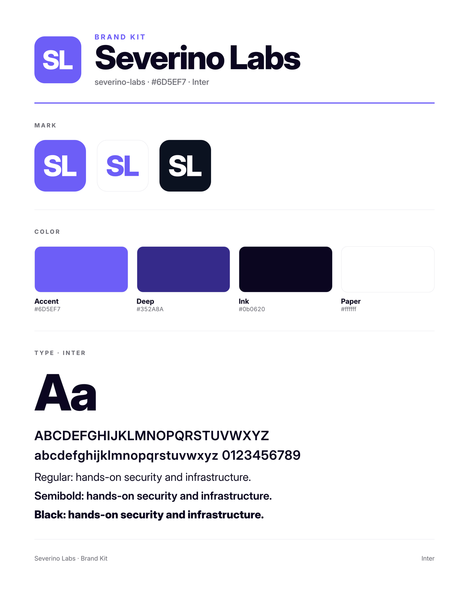
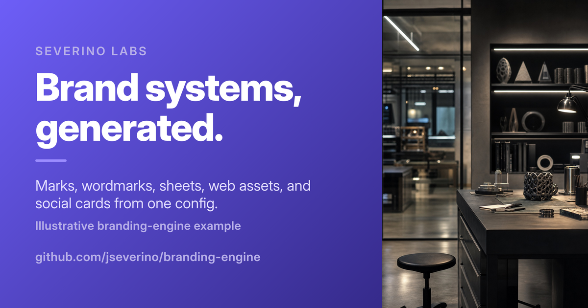

# Severino Labs example

This illustrative example uses the Severino Labs name with a non-production
sample palette. It runs the full-kit `build` command from
[`brand.json`](./brand.json):

```json
{
  "name": "Severino Labs",
  "identity": {
    "slug": "severino-labs",
    "color": "#6D5EF7",
    "deep": "#352A8A",
    "onColor": "#FFFFFF",
    "glyph": "SL",
    "wordmark": "Severino Labs"
  },
  "portrait": "./studio.jpg",
  "cardPalette": {
    "accent": "#9B8CFF",
    "textSoft": "#E3DEFF",
    "textMuted": "#B7AFE8"
  },
  "cards": [
    {
      "file": "social-card.png",
      "width": 1200,
      "height": 630,
      "photoWidth": 420,
      "eyebrow": "Severino Labs",
      "name": "Brand systems, generated.",
      "tagline": "Marks, wordmarks, sheets, web assets, and social cards from one config.",
      "meta": "Illustrative branding-engine example",
      "url": "github.com/jseverino/branding-engine"
    }
  ]
}
```

Regenerate the committed output from the repository root:

```bash
node bin/cli.mjs build \
  --config examples/severino-labs/brand.json \
  --out examples/severino-labs/generated
```

## Preview






## Generated files

```text
generated/severino-labs/
├── icons/
│   ├── apple-touch-icon.png
│   ├── favicon-32.png
│   ├── favicon-192.png
│   ├── favicon.ico
│   └── favicon.svg
├── mark/
│   ├── mark-512.png
│   ├── mark-1024.png
│   ├── mark-transparent-dark.png
│   ├── mark-transparent-light.png
│   └── mark.svg
├── sheet/
│   ├── overview.png
│   ├── palette.png
│   ├── sheet-mark.png
│   └── type-specimen.png
├── web/
│   ├── head.html
│   ├── site.webmanifest
│   └── tokens.css
└── wordmark/
    ├── wordmark-caps-dark.png
    ├── wordmark-caps-light.png
    ├── wordmark-caps.svg
    ├── wordmark-dark.png
    ├── wordmark-light.png
    └── wordmark.svg

generated/cards/
└── social-card.png
```

These files are generated by `branding-engine`; do not edit them by hand.
